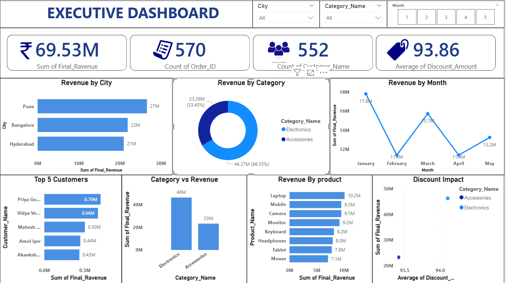

# 📊 Executive Sales Dashboard | Power BI

## 🚀 Project Overview

This project presents an end-to-end Executive Sales Dashboard built using Power BI to analyze revenue performance, customer behavior, product trends, and discount impact.

The dashboard was developed after performing data cleaning, transformation, calculated column creation, and DAX-based KPI development to generate business-driven insights.

---

## 🛠 Technical Implementation

### 🔹 Data Preparation
- Cleaned and transformed raw data using **Power Query**
- Removed inconsistencies and handled missing values
- Structured dataset for analytical reporting

### 🔹 Calculated Columns Created
- `Total_Revenue`
- `Discount_Amount`

### 🔹 DAX Measures Implemented
- Total Revenue
- Order Count
- Customer Count
- Average Discount
- Monthly Revenue
- Category-wise Revenue

### 🔹 Interactive Features
- City Slicer
- Category Slicer
- Month Filter
- KPI Cards
- Dynamic Visualizations

---

## 📈 Dashboard Highlights

### 🔹 Key Performance Indicators (KPIs)
- ₹69.53M Total Revenue
- 570 Total Orders
- 552 Total Customers
- 93.86 Average Discount

### 🔹 Business Insights
- Revenue distribution by city
- Category-wise performance analysis
- Monthly revenue trends
- Top 5 customers by revenue
- Product-wise revenue contribution
- Discount impact on revenue

---

## 📷 Dashboard Preview

---

## 💼 Business Value

This dashboard helps stakeholders:

- Monitor overall revenue performance
- Identify high-performing cities and products
- Track customer purchasing behavior
- Analyze discount effectiveness
- Support executive-level decision making

---

## 🧠 Skills Demonstrated

- Power BI
- Data Cleaning
- Data Transformation
- Data Modeling
- DAX
- Business Intelligence
- Data Visualization
- Analytical Thinking

---

## 📂 Repository Contents

- `Executive_Dashboard.pbix` – Power BI project file
- `dashboard_preview.png` – Dashboard screenshot
- `README.md` – Project documentation

---

## 👨‍💻 Author

**Vishnu Yadav**  
🔗 LinkedIn: https://www.linkedin.com/in/boyanavishnuvardan  
🔗 GitHub: https://github.com/Boyana-Vishnuvardan02
